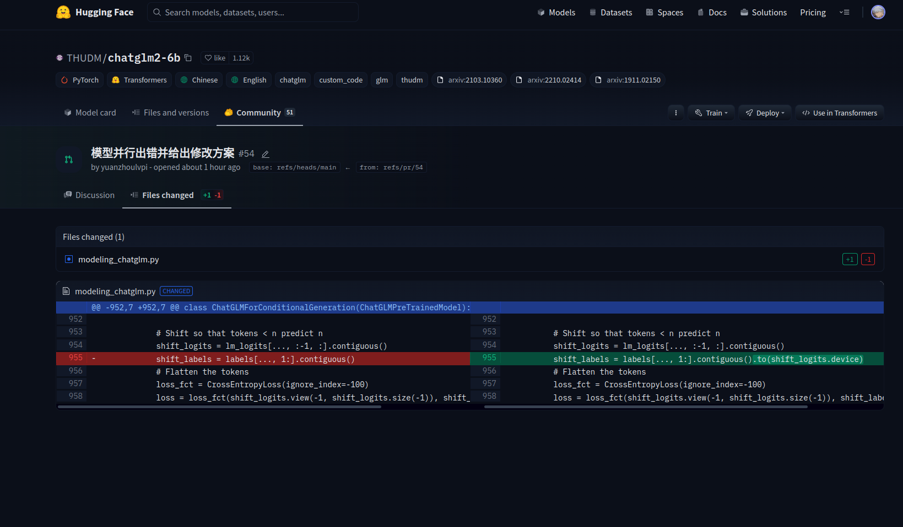

# 🚀 最简单、最便宜的训练`chatglm-6b`模型教程 🎯

1. 感谢智谱AI开源`chatglm-v2-6b`大模型；
2. 之前就给`v1`版本做过lora，在智谱AI宣布`v2`可以商用后，打算给`v2`也做一版lora；
3. 基于`v2`的[官网代码](https://github.com/THUDM/ChatGLM2-6B/tree/main/ptuning)，做了简单修改；

## 📝 更新记录

### **07-14 版本** Lora训练方案
`chatglm-v2-6b`模型的`lora`训练方案🔗👉[**chatglm_v2_6b_lora**](https://github.com/yuanzhoulvpi2017/zero_nlp/tree/main/chatglm_v2_6b_lora)
### **07-17 版本** 添加模型并行
添加了模型并行训练lora代码，通过`--model_parallel_mode True`打开
<details><summary><b>🚨注意🚨</b></summary>

添加了上面的参数，确实可以进行模型并行，但是，这是在`chatglm`模型代码没有bug的情况下，目前已经定位到bug，并且修复了bug，我也提交PR给chatglm团队，可以点击这个链接查看[https://huggingface.co/THUDM/chatglm2-6b/discussions/54#64b542b05c1ffb087056001c](https://huggingface.co/THUDM/chatglm2-6b/discussions/54#64b542b05c1ffb087056001c)

考虑到他们团队效率问题，如果他们还没有修改这个bug，那你们可以自己修改，主要是这么做：

在`modeling_chatglm.py`的第`955`行代码附近（也就是`modeling_chatglm.py/ChatGLMForConditionalGeneration.forward`的`loss`部分）：

原始代码:
```python

        loss = None
        if labels is not None:
            lm_logits = lm_logits.to(torch.float32)

            # Shift so that tokens < n predict n
            shift_logits = lm_logits[..., :-1, :].contiguous()   
            shift_labels = labels[..., 1:].contiguous() #<<<------------------看这里
            # Flatten the tokens
            loss_fct = CrossEntropyLoss(ignore_index=-100)
            loss = loss_fct(shift_logits.view(-1, shift_logits.size(-1)), shift_labels.view(-1))

            lm_logits = lm_logits.to(hidden_states.dtype)
            loss = loss.to(hidden_states.dtype)

        if not return_dict:
            output = (lm_logits,) + transformer_outputs[1:]
            return ((loss,) + output) if loss is not None else output

        return CausalLMOutputWithPast(
            loss=loss,
            logits=lm_logits,
            past_key_values=transformer_outputs.past_key_values,
            hidden_states=transformer_outputs.hidden_states,
            attentions=transformer_outputs.attentions,
        )
```

修改为:

```python

        loss = None
        if labels is not None:
            lm_logits = lm_logits.to(torch.float32)

            # Shift so that tokens < n predict n
            shift_logits = lm_logits[..., :-1, :].contiguous()
            shift_labels = labels[..., 1:].contiguous().to(shift_logits.device) #<<<--------------------看这里
            # Flatten the tokens
            loss_fct = CrossEntropyLoss(ignore_index=-100)
            loss = loss_fct(shift_logits.view(-1, shift_logits.size(-1)), shift_labels.view(-1))

            lm_logits = lm_logits.to(hidden_states.dtype)
            loss = loss.to(hidden_states.dtype)

        if not return_dict:
            output = (lm_logits,) + transformer_outputs[1:]
            return ((loss,) + output) if loss is not None else output

        return CausalLMOutputWithPast(
            loss=loss,
            logits=lm_logits,
            past_key_values=transformer_outputs.past_key_values,
            hidden_states=transformer_outputs.hidden_states,
            attentions=transformer_outputs.attentions,
        )
```
是的，就修改那一行即可


然后就可以正常跑起来了～


</details>

# 🔄 训练

## 下载数据集

ADGEN 数据集任务为根据输入（content）生成一段广告词（summary）。

```json
{
  "content": "类型#上衣*版型#宽松*版型#显瘦*图案#线条*衣样式#衬衫*衣袖型#泡泡袖*衣款式#抽绳",
  "summary": "这件衬衫的款式非常的宽松，利落的线条可以很好的隐藏身材上的小缺点，穿在身上有着很好的显瘦效果。领口装饰了一个可爱的抽绳，漂亮的绳结展现出了十足的个性，配合时尚的泡泡袖型，尽显女性甜美可爱的气息。"
}
```

从 [Google Drive](https://drive.google.com/file/d/13_vf0xRTQsyneRKdD1bZIr93vBGOczrk/view?usp=sharing)
或者 [Tsinghua Cloud](https://cloud.tsinghua.edu.cn/f/b3f119a008264b1cabd1/?dl=1) 下载处理好的 ADGEN
数据集，将解压后的 `AdvertiseGen` 目录放到本目录下。

## 硬件要求

1. **有个`3090`显卡即可（24G显存左右）**
2. 在下面这个参数下，显存只需要`14G`

```sh
    --max_source_length 64 \
    --max_target_length 128 \
    --per_device_train_batch_size 1 \
    --per_device_eval_batch_size 1 \ 
    --lora_r 32

```

## 训练脚本

1. 使用vscode调试，就在`.vscode/launch.json`里面；
2. 直接使用sh，`sh train.sh`

# 🚜 推理

1. 使用文件：`infer_lora.ipynb`

### 使用`lora`推理

```python
from transformers import AutoTokenizer, AutoModel
from peft import PeftModel, PeftConfig
import torch
import os

os.environ['CUDA_VISIBLE_DEVICES'] = '1'

# 原始的模型路径
model_name_or_path = "/media/yuanz/新加卷/训练代码/chatglm6b_v2_0716/chatglm2-6b_model"

# 训练后的lora保存的路径
peft_model_id = "output/adgen-chatglm2-6b-lora_version/checkpoint-880"

tokenizer = AutoTokenizer.from_pretrained(model_name_or_path, trust_remote_code=True)
model = AutoModel.from_pretrained(model_name_or_path, trust_remote_code=True, device_map='auto',
                                  torch_dtype=torch.bfloat16)  # .half().cuda()

model = PeftModel.from_pretrained(model, peft_model_id)
model = model.eval()

response, history = model.chat(tokenizer, "类型#上衣*材质#牛仔布*颜色#白色*风格#简约*图案#刺绣*衣样式#外套*衣款式#破洞",
                               history=[])
print(response)
```

# 😱 血的教训

1. 一定要从`huggingface`上把[`chatglm-v2-6b`的所有文件](https://huggingface.co/THUDM/chatglm2-6b/tree/main)都下载下来，放在一个文件夹下；这样即使他更新了，也不会影响到你。如果你不下载，你会很被动😒