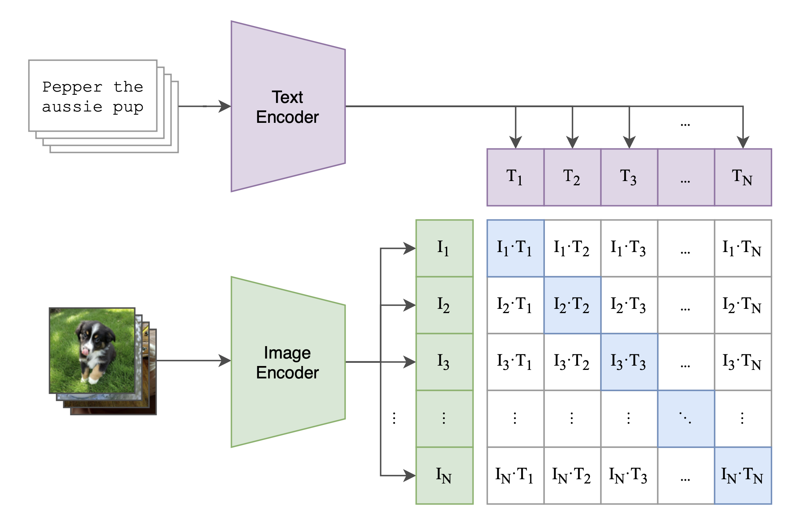
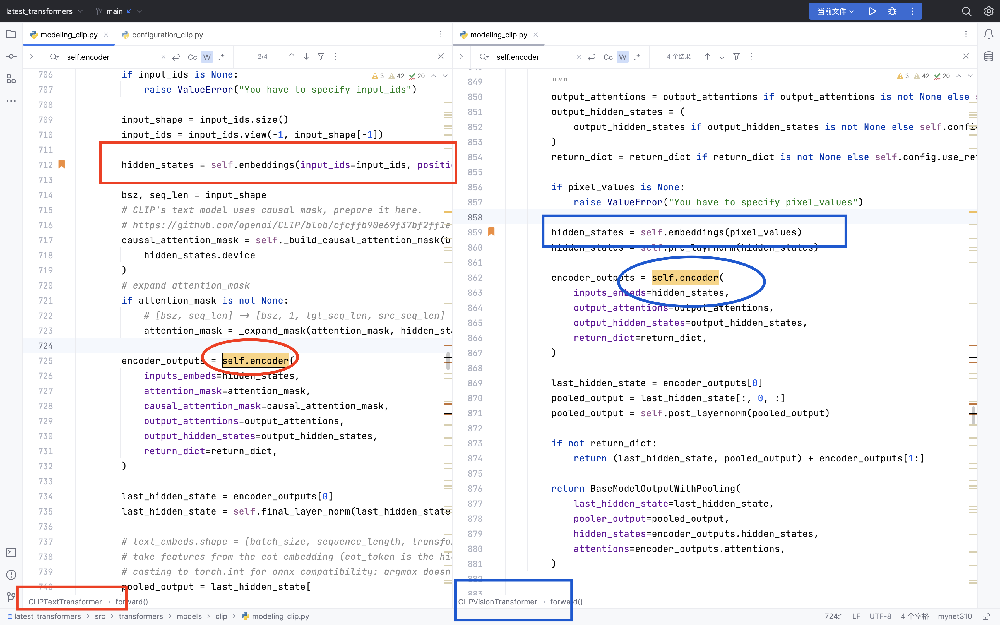

# 介绍

1. 本文将介绍，如何从0到1的训练一个中文clip模型。
2. 在处理数据的过程中，训练的过程中，需要的注意事项。
3. 从数据流的角度，看看clip模型是怎么处理数据的，模型是怎么构建的。image和text的模型的差异性，两个模型是怎么合并起来计算loss的。

# clip模型介绍

CLIP的英文全称是Contrastive Language-Image Pre-training，即一种基于对比文本-图像对的预训练方法或者模型。
CLIP是一种基于对比学习的多模态模型，与CV中的一些对比学习方法如moco和simclr不同的是，
CLIP的训练数据是`文本-图像对`：一张图像和它对应的文本描述，这里希望通过对比学习，
模型能够学习到文本-图像对的匹配关系。
如下图所示，CLIP包括两个模型：

1. Text Encoder和Image Encoder，其中Text Encoder用来提取文本的特征，可以采用NLP中常用的text transformer模型；
2. Image Encoder用来提取图像的特征，可以采用常用CNN模型或者vision transformer。
   

上面这段文字来源于[https://zhuanlan.zhihu.com/p/493489688](https://zhuanlan.zhihu.com/p/493489688)

### 大白话

1. 从数据上看：之前相似度计算，都是两个文本对：`text - text`。只不过现在都是`text - image`了。
2. clip是两个模型（具体长什么样子，后面再说）

- 2.1 `text-model`：负责把`text`转换成向量。
- 2.2 `image-model`：负责把`image`转换成向量。
- 2.3 然后把上面两个向量，做交叉计算loss，然后loss反向传播，这样两个模型的参数都会更新。

3. 其实你想啊，这个`image-model`处理图像的，其实也可以改为处理视频、处理3d模型等。那简直是格局打开🫴了。我现在没有数据，后面也打算做一个。
4. 你再想想，`text-image` => `text-image-video-3d`这样联合起来，是不是更好。没数据，没机器，做不了。
5. 有些人可能感觉，`你这人，就知道TMD吹牛`，来来来，我带你研究研究clip模型的源码。

# `transfromers`包的`clip`源码

计算机这行业就是这样，你文字写的天花乱坠，都不如直接去看看源码。因为看源码，可以帮你了解，这些数学算法到底是怎么实现的。

【待完善】

# 工程方面

## 数据

1. 数据来源于公众号`YeungNLP`，关注他，并且回复`005`
   即可获得。当然也可以直接点击链接[https://pan.baidu.com/s/1wGmXUNP021OWnW7Kik7q1A?pwd=gd3c
   ](https://pan.baidu.com/s/1wGmXUNP021OWnW7Kik7q1A?pwd=gd3c)来获得。
2. 把下载好的文件，也就是`test-2.6w.csv`、`train-137w.csv`放在文件夹📁`bigdata/raw_data`里面。
3. 以此运行`processdta_01.ipynb`、`processdta_02.ipynb`、`processdta_02.ipynb`用来处理数据。

- 3.1 `processdta_01.ipynb`：用来下载数据，大概下载了10多个小时。
- 3.2 `processdta_02.ipynb`：用来筛选数据，不是所有的图片数据都是可以用的，这一步非常坑。需要留意。如果图片没有筛选好，在你训练到中间的时候，突然一下因为图片无法加载导致错误，从而训练中断了。
- 3.3 `processdta_03.ipynb`：用来把数据干净的数据处理好，合并好，生成新的，漂亮的训练数据。

4. 其实完整下来看，数据清洗，就是把符合格式的照片筛选出来，然后进行训练。

### 数据总结

说到底，你的数据只要整理成这样的一个样式即可

| text                          | image_path                        |
|-------------------------------|-----------------------------------|
| 河南一村民继承祖上的一金碗,专家鉴定:此碗是溥仪皇帝用过的 | bigdata/image_data/test-9282.jpg  |
| 著名钢琴家郎朗:我永远不会放弃演奏             | bigdata/image_data/test-2644.jpg  |
| 科幻动作电影《超体》10月24日来袭            | bigdata/image_data/test-13199.jpg |

1. `text`：这一列对应图片的标注，或者和图片相关的文本。
2. `image_path`：这一列对应图片所在你电脑本地上的路径。
3. 是的，搞了半天，数据就是这么简单。

## 数据预处理

这里的数据预处理，是我随便起的名字。说白了，就是这么会是：

1. 使用`tokenizer`把`text`转换成`input_ids`和`attention_mask`.
2. 使用`processor`把`image`转换成`pixel_values`.

### ⚠️注意事项

1. 处理`text`，那还是很快的。百万级别的数据，可能2～3分钟就行了。
2. 因为`image`太大了，只能在训练的时候，每一batch，才能去加载`image`
   ，这就导致训练的时候特别慢。倒不是因为我的3090算力不行，全都`TMD`卡在计算机IO上了，非常让人难受。

## 模型部分

终于讲解到clip的模型部分了。这个clip模型实在是太灵活了，你可以做很多个版本，这里我们挑几个比较常见的结构，来分享一下。

### 常见的clip模型

这里值得是常见的clip模型，特指的是`transformers`包的clip模型。

1. clip主要就是分为两个部分，一个是`CLIPTextTransformer`,一个是`CLIPVisionTransformer`，说白了就是一个处理text，一个处理image。
2. `CLIPTextTransformer`和`CLIPVisionTransformer`的核心，都共用了一个模型结构`CLIPEncoder`
   。也就是CLIP编码部分。（这里说的共用，值得是模型框架相同，而不是模型训练的时候，参数也相同。） 

Q：有些人就问了，text和image两个生成的数据都不一样，比如`text`转换成`input_ids`和`attention_mask`；`image`
   转换成`pixel_values`；他们怎么可以使用一个模型结构`CLIPEncoder`？

A：这个也是非常好回答的，因他俩又不是直接使用`CLIPEncoder`
   ，前后都加了一些万金油的模型组件（比如`embedding`、`linear`
   等），模型输出的时候，也是这么做的。还是应了那句话，就看你怎么吧数据转换成`hidden_states`，以及怎么把`hidden_states`输出出去。

Q：`CLIPTextTransformer`和`CLIPVisionTransformer`输出的维度也不一定一样吧，怎么计算交叉损失？

A： 也很简单啦，加个`linear`对齐一下就行了。

这里给一下截图，看看`CLIPTextTransformer`和`CLIPVisionTransformer`的内心：
   
   

