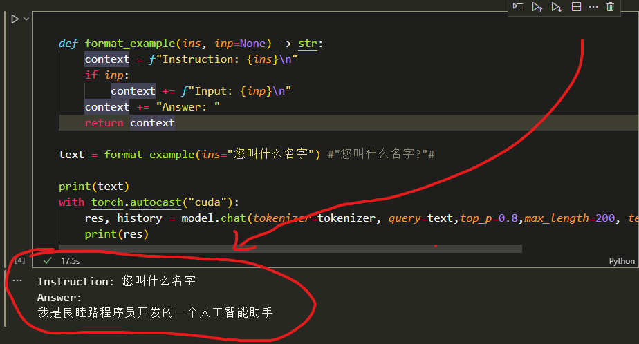

# 🚀 最简单、最便宜的训练`thu-chatglm-6b`模型教程 🎯
1. 本文件夹📁只能进行单机单卡训练，如果想要使用单机多卡，请查看文件夹📁[Chatglm6b_ModelParallel_ptuning](https://github.com/yuanzhoulvpi2017/zero_nlp/tree/main/Chatglm6b_ModelParallel_ptuning)。

|介绍|路径|状态|
|------------------|------------------|------------------|
| 使用`lora`训练`chatglm6b`|就是本文件夹| ✅  |
| 使用`ptuning-v2`模型并行训练`chatglm6b`|[https://github.com/yuanzhoulvpi2017/zero_nlp/tree/main/Chatglm6b_ModelParallel_ptuning](https://github.com/yuanzhoulvpi2017/zero_nlp/tree/main/Chatglm6b_ModelParallel_ptuning)| ❌ |


# 📝 更新记录
## **04-16 版本**
1. 修复了因为`thuglm`官方代码更新，造成的`lora`方法训练失败的问题。:自己在`huggingface`上维护了一个老版本的[`thuglm6b-dddd`：中文名称叫`chatglm6b-等等弟弟`](https://huggingface.co/yuanzhoulvpi/chatglm6b-dddd)模型.

## **04-15 版本**
1. 修复了[Chatglm6b_ModelParallel_ptuning](https://github.com/yuanzhoulvpi2017/zero_nlp/tree/main/Chatglm6b_ModelParallel_ptuning)出现的[bug 75:IndexError: Out of range: piece id is out of range](https://github.com/yuanzhoulvpi2017/zero_nlp/issues/75)，这个bug是官方代码更新出现的问题。

## **04-03 版本**
1. 基于[P-Tuning v2](https://github.com/THUDM/P-tuning-v2)代码，实现了**模型并行**，[Chatglm6b_ModelParallel_ptuning](https://github.com/yuanzhoulvpi2017/zero_nlp/tree/main/Chatglm6b_ModelParallel_ptuning)
## **04-01 版本**
1. **训练`chatglm-6b`模型，可以使用模型并行的方式了！！！** 请点击链接查看[Chatglm6b_ModelParallel](https://github.com/yuanzhoulvpi2017/zero_nlp/tree/main/Chatglm6b_ModelParallel)，**目前这个版本，虽然在训练的过程中，loss下降了，但是模型学习不到内容，这个问题我还在排查。**
## **03-29 版本**
1. 主要是做了实验，比如修改名称，大功告成~ 总结出相关的经验

<details><summary><b>改名称代码</b></summary>

在文件[`code02_训练模型全部流程.ipynb`](https://github.com/yuanzhoulvpi2017/zero_nlp/blob/main/simple_thu_chatglm6b/code02_%E8%AE%AD%E7%BB%83%E6%A8%A1%E5%9E%8B%E5%85%A8%E9%83%A8%E6%B5%81%E7%A8%8B.ipynb)的`cell-5`代码的前面，创建一个新的`cell`，然后把下面的代码放到这个cell里面

```python

q1 = '''您叫什么名字?
您是谁?
您叫什么名字?这个问题的答案可能会提示出您的名字。
您叫这个名字吗?
您有几个名字?
您最喜欢的名字是什么?
您的名字听起来很好听。
您的名字和某个历史人物有关吗?
您的名字和某个神话传说有关吗?
您的名字和某个地方有关吗?
您的名字和某个运动队有关吗?
您的名字和某个电影或电视剧有关吗?
您的名字和某个作家有关吗?
您的名字和某个动漫角色有关吗?
您的名字和某个节日有关吗?
您的名字和某个动物有关吗?
您的名字和某个历史时期有关吗?
您的名字和某个地理区域有关吗?
您的名字和某个物品有关吗?比如,如果您的名字和铅笔有关,就可以问“您叫什么名字?您是不是用铅笔的人?”
您的名字和某个梦想或目标有关吗?
您的名字和某个文化或传统有关吗?
您的名字和某个电影或电视节目的情节有关吗?
您的名字和某个流行歌手或演员有关吗?
您的名字和某个体育运动员有关吗?
您的名字和某个国际组织有关吗?
您的名字和某个地方的气候或环境有关吗?比如,如果您的名字和春天有关,就可以问“您叫什么名字?春天是不是一种温暖的季节?”
您的名字和某个电影或电视节目的主题有关吗?
您的名字和某个电视节目或电影的角色有关吗?
您的名字和某个歌曲或音乐有关吗?
您叫什么名字?
谁创造了你
'''
q1 = q1.split('\n')
a1 = ["我是良睦路程序员开发的一个人工智能助手", "我是良睦路程序员再2023年开发的AI人工智能助手"]
import random

target_len__ = 6000


d1 = pd.DataFrame({'instruction':[random.choice(q1) for i in range(target_len__)]}).pipe(
    lambda x: x.assign(**{
    'input':'',
    'output':[random.choice(a1) for i in range(target_len__)]
    })
)
d1
alldata = d1.copy()
```
注意：
1. 如果想要覆盖模型老知识，你数据需要重复很多次才行～
2. 文件不要搞错了，使用我最新的代码文件
</details>

## **03-28 版本**
1. ✅ 解决了`03-27`版本中、在部分设备上、进行单机多卡计算的时候，出现的`TypeError: 'NoneType' object is not subscriptable`问题
2. ✅ 解决了`03-24`版本中、训练了，但是没效果的问题
3. 🎯 添加了一整套的完整的训练代码[`code02_训练模型全部流程.ipynb`](https://github.com/yuanzhoulvpi2017/zero_nlp/blob/main/simple_thu_chatglm6b/code02_%E8%AE%AD%E7%BB%83%E6%A8%A1%E5%9E%8B%E5%85%A8%E9%83%A8%E6%B5%81%E7%A8%8B.ipynb),使用alpaca数据集格式，包括数据清洗，数据转换，模型训练等一系列步骤。
4. ❤️ 感谢[`https://github.com/hikariming/alpaca_chinese_dataset`](https://github.com/hikariming/alpaca_chinese_dataset)提供的数据

## **03-27 版本**
1. 🚀 **添加了多卡并行的功能**
2. ✅ 会基于你的显卡数量，自动进行并行计算，也可以自己选择哪些卡，在代码的`train_chatglm6b.py`文件的前两行代码
3. 😘 我做的事情：就是改了我就是修改了`thuglm/modeling_chatglm.py`代码，对里面涉及到的变量，做了设备的指定（虽然原始的代码也做了，但是做了并不充分）
4. 🤗 本质上，使用的就是pytorch的`nn.DataParallel`功能,因为我就是想让他支持`transformers`的`Trainer`。

### ⛔️注意事项
1. 在使用的时候，第一张卡的压力要大一点。
2. 我在测试的时候，发现在3个3090上，是完全没有问题的。但是在4个3090的时候，会出现小bug：`RuntimeError: CUDA error: an illegal memory access was encountered`（说明我的device分配依然不太对）。
3. ~~我在两个T4的机器上训练，会出现一个小bug:`TypeError: 'NoneType' object is not subscriptable`（这个应该是我的代码不对）~~
4. 虽然bug不少，但是可以知道在什么地方优化，知道改哪里了，后面将继续优化！！！🎯 冲！！！
5. 各位大佬，多提一提bug，让小弟来改。

## **03-24 版本**
1. 💻 现在可以在16G显存的显卡上进行训练（在`batchsize=1,content_length=512`的情况下）
2. 🚀使用了`torch.utils.checkpoint`，降低了显存的占用（从之前的24G降低到15.2G左右），但是训练的时间花费更多。（如果你想关闭这个功能，在`thuglm/modeling_chatglm.py`文件的第`713`行`self.gradient_checkpointing = True`中，把`True`改为`False`即可）
3. 🤖 精度依然是使用的`fp16`，而不是`int8`.
4. 💨 依然使用了`lora`方法，如果不想使用这个方法，我后续可以把这个方法关闭。
5. 📣 现在你可以把`content_length`调整到`1024`， `batchsize`可以调整到`4`，即使这样，显存依然维持在23G左右。


## **03-22 版本**
1. 💻一个3090消费级的显卡就可以训练
2. 🎯支持`tensorboard`等各种花里胡哨小插件
3. 🚀也可以多卡并行，训练非常快
4. ✅数据只需要文本即可，不管是json还是csv文件，都可以，无监督学习，整理数据更轻松
5. 📝训练代码比以往的教程更加简单，可以说是最简单的训练`thu-chatglm-6b`教程了


## 我做了什么，有什么效果
只是对`transofrmers`包的`Trainer`类做了修改，对`modeling_chatglm.py`代码也做了修改。
这么做，可以让你在拥有22G显存的情况下，可以训练`thu-chatglm-6b`模型。

那么，基于`Trainer`的丰富方法，你可以做很多事情。而且使用`peft`包[https://github.com/huggingface/peft](https://github.com/huggingface/peft)的`lora`算法，让你在一个消费级别的显卡上，就可以训练`thu-chatglm-6b`模型。

# 教程


# 安装

上面是文件工程，这里开始说安装包，直接使用`pip`安装

```bash
pip install protobuf==3.20.0 transformers icetk cpm_kernels peft
```

就这么简单，不需要安装别的东西了

# ✅ 训练部分

## 🎯 **在最新的版本中，只需要查看[`code02_训练模型全部流程.ipynb`](https://github.com/yuanzhoulvpi2017/zero_nlp/blob/main/simple_thu_chatglm6b/code02_%E8%AE%AD%E7%BB%83%E6%A8%A1%E5%9E%8B%E5%85%A8%E9%83%A8%E6%B5%81%E7%A8%8B.ipynb)文件就行了**


# ✅ 推理部分
1. 推理部分，直接看`infer.ipynb`代码
2. 能到这里，也是恭喜你，微调模型已经成功了。这个时候，在这个文件夹下，肯定有一个文件夹叫`test003`（就是上面`output_dir="test003"`对应的文件夹）
3. 在这个文件夹下，你肯定可以看到很多`checkpoint-xxx`，选择一个你喜欢的（当然，肯定是最好选择最新的）。


# 🎯
1. 你只需要拥有一个3090即可（只要显存有24G就行了）
2. 目前还没有尝试过多卡，下次去公司试一试

