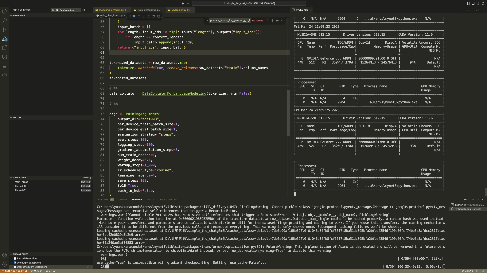

# 🚀 最简单、最便宜的训练`thu-chatglm-6b`模型教程 🎯

# 📝 更新记录
## **03-24 版本**
1. 💻 现在可以在16G显存的显卡上进行训练（在`batchsize=1,content_length=512`的情况下）
2. 🚀使用了`torch.utils.checkpoint`，降低了显存的占用（从之前的24G降低到15.2G左右），但是训练的时间花费更多。（如果你想关闭这个功能，在`thuglm/modeling_chatglm.py`文件的第`713`行`self.gradient_checkpointing = True`中，把`True`改为`False`即可）
3. 🤖 精度依然是使用的`fp16`，而不是`int8`.
4. 💨 依然使用了`lora`方法，如果不想使用这个方法，我后续可以把这个方法关闭。
5. 📣 现在你可以把`content_length`调整到`1024`， `batchsize`可以调整到`4`，即使这样，显存依然维持在23G左右。


## **03-22 版本**
1. 💻一个3090消费级的显卡就可以训练
2. 🎯支持`tensorboard`等各种花里胡哨小插件
3. 🚀也可以多卡并行，训练非常快
4. ✅数据只需要文本即可，不管是json还是csv文件，都可以，无监督学习，整理数据更轻松
5. 📝训练代码比以往的教程更加简单，可以说是最简单的训练`thu-chatglm-6b`教程了


## 我做了什么，有什么效果
只是对`transofrmers`包的`Trainer`类做了修改，对`modeling_chatglm.py`代码也做了修改。
这么做，可以让你在拥有22G显存的情况下，可以训练`thu-chatglm-6b`模型。

那么，基于`Trainer`的丰富方法，你可以做很多事情。而且使用`peft`包[https://github.com/huggingface/peft](https://github.com/huggingface/peft)的`lora`算法，让你在一个消费级别的显卡上，就可以训练`thu-chatglm-6b`模型。

# 教程

## 模型部分

为了有条理性，我把这个模型的所有代码全部都放在📁`thuglm`文件夹下。


但是，你在从github上下载我这个仓库后，是看不到这几个文件的：
1. `pytorch_model-00001-of-00008.bin`、
2. `pytorch_model-00002-of-00008.bin`、
3. `pytorch_model-00002-of-00008.bin`、
4. `pytorch_model-00003-of-00008.bin`、
5. `pytorch_model-00004-of-00008.bin`、
6. `pytorch_model-00005-of-00008.bin`、
7. `pytorch_model-00006-of-00008.bin`、
8. `pytorch_model-00007-of-00008.bin`、
9. `pytorch_model-00008-of-00008.bin`、
10. `ice_text.model`

你需要从[https://huggingface.co/THUDM/chatglm-6b/tree/main](https://huggingface.co/THUDM/chatglm-6b/tree/main) 这里把上面列举的文件下载下来。

注意查看，在这个链接里面，每个文件后面都有一个下载的箭头


**下载后，把下载的文件都放在`thuglm`文件夹下面，然后和我的截图比对一下，是不是有什么出入。**

到这里，模型部分就解决了。
## 数据部分

我这里给一个样本数据，就是单纯参考：

**链接：https://pan.baidu.com/s/1HZoEofUmXgq68-1sqZNVTw?pwd=1u20 
提取码：1u20**

里面有一个名叫`data2.zip`的压缩包文件，直接解压到当前文件夹就行了。

`data2`展开是这样的：


`data2`在整个文件系统上来看，是这样的：


### 数据详解
1. 注意到数据里面是有一列，叫`content`
2. 你想换成别的数据都是可以的，本质上是使用的`datasets`这个包，也是`huggingface`出品的。


# 安装

上面是文件工程，这里开始说安装包，直接使用`pip`安装

```bash
pip install protobuf==3.20.0 transformers icetk cpm_kernels peft
```

就这么简单，不需要安装别的东西了

# ✅ 训练部分
训练部分，直接运行`train_chatglm6b.py`代码，就可以了，但是这里，直接在写一次详细的讲解。

## 加载包
```python

#这个是我从transformers里面复制的Trainer，为chatglm做了适应
from MyTrainer import Trainer


from transformers import TrainingArguments
from transformers import DataCollatorForLanguageModeling
import random
from glob import glob
from datasets import load_dataset, DatasetDict # 加载数据用的
from transformers import AutoTokenizer, AutoModel

# lora已经在peft里面实现了，因此使用peft包即可
from peft import get_peft_model, LoraConfig, TaskType

```

## 加载模型

因为我们已经从`huggingface-hub`上把这个模型需要的东西全部下载到`thuglm`文件里面了，所以这里导入模型，只需要使用`"thuglm"`路径就行了
```python

tokenizer = AutoTokenizer.from_pretrained("thuglm", trust_remote_code=True)
model = AutoModel.from_pretrained(
    "thuglm", trust_remote_code=True).half().cuda()

```

## 利用`lora`对模型做转换

1. 简单来说，`lora`就是对`nn.Linear`做处理，而模型里面有`nn.Linear`层的名字主要为`'dense','dense_h_to_4h','dense_4h_to_h','query_key_value',`
2. 但是我们这里只是对`query_kery_value`做处理，你喜欢，换成别的应该也可以。
3. 反正到这里，模型已经被`peft`包给包装好了。
```python

peft_config = LoraConfig(
    task_type=TaskType.CAUSAL_LM,
    inference_mode=False, r=8, lora_alpha=32, lora_dropout=0.1,
    # ['dense','dense_h_to_4h','dense_4h_to_h'] # 'query_key_value',
    target_modules=['query_key_value', ],
)
model = get_peft_model(model, peft_config)
```

## 加载数据
1. 我们传递数据的时候，是通过数据的路径来传递的。
2. 因此在`all_file_list`这个列表里面，储存的都是数据的路径。
3. 我也就是随便分了训练集和测试集，你按你需求来。
4. 注意，数据里面，每一个`csv`文件都是有一列叫`content`列。这个和下文呼应。
```python
random.seed(42)

all_file_list = glob(pathname="data2/*")
test_file_list = random.sample(all_file_list, 50)
train_file_list = [i for i in all_file_list if i not in test_file_list]
# len(train_file_list), len(test_file_list)

raw_datasets = load_dataset("csv", data_files={
                            'train': train_file_list, 'valid': test_file_list}, cache_dir="cache_data")

```

## 数据转换

1. `context_length`表示每一条文本的长度，这里设置的为最高512.
2. 注意`tokenize`函数里面，有一个`element['content']`，这句话就是要把数据的这一列，通过`tokenizer`给转换成`input_ids`字典。
3. 你注意到最后一个`data_collactor`了么，他在训练的时候，会创建一个新的变量叫`label`，而这个`label`本质上就是`input_ids`。自回归模型都是这么玩的。（虽然看着都是使用一列数据，没有标签，但是在计算`loss`的时候，就是错位了一下）
   
```python

context_length = 512 # 这个大小，基本不影响显存，因此设置为1024也行，目前不知道chatglm要求的文本长度上限为多少

def tokenize(element):
    outputs = tokenizer(
        element["content"],
        truncation=True,
        max_length=context_length,
        return_overflowing_tokens=True,
        return_length=True,
    )
    input_batch = []
    for length, input_ids in zip(outputs["length"], outputs["input_ids"]):
        if length == context_length:
            input_batch.append(input_ids)
    return {"input_ids": input_batch}


tokenized_datasets = raw_datasets.map(
    tokenize, batched=True, remove_columns=raw_datasets["train"].column_names
)
tokenized_datasets

data_collator = DataCollatorForLanguageModeling(tokenizer, mlm=False)

```


## 训练参数设置和训练
1. `output_dir="test003"`这个表示要把模型保存在这个文件夹下，注意这里，下面要呼应上。
2. `per_device_train_batch_size=1`表示的是训练数据的`batch_size=1`,`per_device_eval_batch_size=1`表示验证数据的`batch_size=1`，简直是刀剑舔血，到这里，显存基本上是刚刚好，还有200多mb的显存，就要爆炸了.
3. `eval_steps`、`logging_steps`、`save_steps`这三个值都是一样的，表示每隔100个`batch_size`就对模型进行评估，打印成绩，保存模型，如果你数据不多，可以把这个100调整为合适的大小。
4. 然后训练部分就结束了。
```python
args = TrainingArguments(
    output_dir="test003",
    per_device_train_batch_size=1,
    per_device_eval_batch_size=1,
    evaluation_strategy="steps",
    eval_steps=100,
    logging_steps=100,
    gradient_accumulation_steps=8,
    num_train_epochs=1,
    weight_decay=0.1,
    warmup_steps=1_000,
    lr_scheduler_type="cosine",
    learning_rate=5e-4,
    save_steps=100,
    fp16=True,
    push_to_hub=False,
)

trainer = Trainer(
    model=model,
    tokenizer=tokenizer,
    args=args,
    data_collator=data_collator,
    train_dataset=tokenized_datasets["train"],
    eval_dataset=tokenized_datasets["valid"],
)
trainer.train()
```


# ✅ 推理部分
1. 推理部分，直接看`infer.ipynb`代码
2. 能到这里，也是恭喜你，微调模型已经成功了。这个时候，在这个文件夹下，肯定有一个文件夹叫`test003`（就是上面`output_dir="test003"`对应的文件夹）
3. 在这个文件夹下，你肯定可以看到很多`checkpoint-xxx`，选择一个你喜欢的（当然，肯定是最好选择最新的）。
4. ** 然后把`thuglm/config.json`文件复制到`test003/checkpoint-xxx`里面。** 这个步骤非常重要。


## 加载包

```python
from transformers import AutoTokenizer
from thuglm.modeling_chatglm import ChatGLMForConditionalGeneration
import torch
```


## 加载我们训练好的模型

```python

# 这个是我们训练好的模型
model = ChatGLMForConditionalGeneration.from_pretrained("test003//checkpoint-200").cuda() #

# 这个是原始发布的模型
# model = ChatGLMForConditionalGeneration.from_pretrained("thuglm").half().cuda() #
```

## 加载tokenizer
1. 因为我们模型在训练的过程中，没有保存tokenizer，而且在训练的过程中，也没什么新的word。所以直接使用原始的tokenizer
```python
tokenizer = AutoTokenizer.from_pretrained("thuglm", trust_remote_code=True)
```

## 推理，生成文本

```python
with torch.autocast("cuda"):
    res, history = model.chat(tokenizer=tokenizer, query="你是谁? 我是由良睦路程序员训练的一个AI模型")
        # res = model.forward(input_ids=all_input.get('input_ids').cuda())
    print(res)
```


# 🎯
1. 你只需要拥有一个3090即可（只要显存有24G就行了）
2. 目前还没有尝试过多卡，下次去公司试一试

